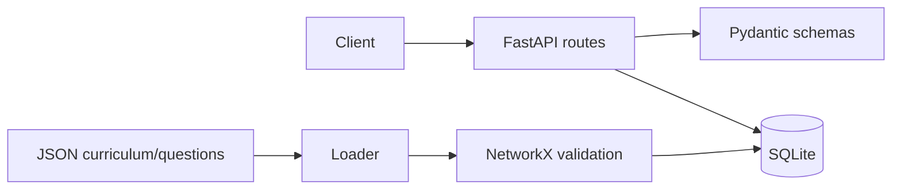

# Architecture

Milestone 1 separates HTTP routing, typed schemas, persistence models, and curriculum data. SQLite holds local learner profiles and curriculum content; JSON files are the versioned source for seed curriculum and questions. NetworkX validates the prerequisite graph before seeding.

The future adaptive decision loop will add learner-state estimation, misconception detection, resource monitoring, controller selection, recommendation scoring, and local synchronisation without moving the existing API/persistence boundary.

## Learner model

Milestone 2 persists current concept state separately from append-only `mastery_history`. Bayesian Knowledge Tracing updates are numerically clamped and use difficulty defaults with concept-specific overrides. Mastery and uncertainty are distinct estimates: the default heuristic combines evidence, response consistency, and normalised response-time variation; entropy and combined modes are also available. Retained mastery is calculated dynamically at read time using exponential decay, so viewing progress never changes stored mastery.

## Educational intelligence

The curriculum graph exposes direct and transitive prerequisite queries. A concept is eligible only when every direct prerequisite meets its own mastery threshold. Misconception rules live in `data/misconceptions/fractions.json`; the detector only returns a result after repeated, recent, matching incorrect evidence. Diagnostic selection targets the highest-uncertainty eligible concept, while spaced review takes precedence when a mastered concept's retained mastery falls below threshold.

## Resource-aware controller

The monitor reads memory, CPU, storage, battery (when available), and bounded network reachability. Missing battery data receives a neutral score rather than failing the system. Resource score combines memory (0.35), CPU availability (0.25), battery (0.20), and network (0.20), then classifies the result with configurable thresholds. The controller applies its documented priority order and returns the triggered rule, rejected matching alternatives, computational cost estimate, and confidence.
