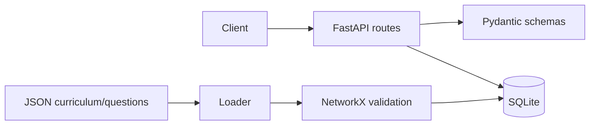

# Architecture

Milestone 1 separates HTTP routing, typed schemas, persistence models, and curriculum data. SQLite holds local learner profiles and curriculum content; JSON files are the versioned source for seed curriculum and questions. NetworkX validates the prerequisite graph before seeding.

The future adaptive decision loop will add learner-state estimation, misconception detection, resource monitoring, controller selection, recommendation scoring, and local synchronisation without moving the existing API/persistence boundary.

