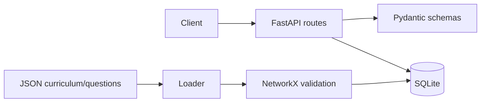

# Architecture

Milestone 1 separates HTTP routing, typed schemas, persistence models, and curriculum data. SQLite holds local learner profiles and curriculum content; JSON files are the versioned source for seed curriculum and questions. NetworkX validates the prerequisite graph before seeding.

The future adaptive decision loop will add learner-state estimation, misconception detection, resource monitoring, controller selection, recommendation scoring, and local synchronisation without moving the existing API/persistence boundary.

## Learner model

Milestone 2 persists current concept state separately from append-only `mastery_history`. Bayesian Knowledge Tracing updates are numerically clamped and use difficulty defaults with concept-specific overrides. Mastery and uncertainty are distinct estimates: the default heuristic combines evidence, response consistency, and normalised response-time variation; entropy and combined modes are also available. Retained mastery is calculated dynamically at read time using exponential decay, so viewing progress never changes stored mastery.
